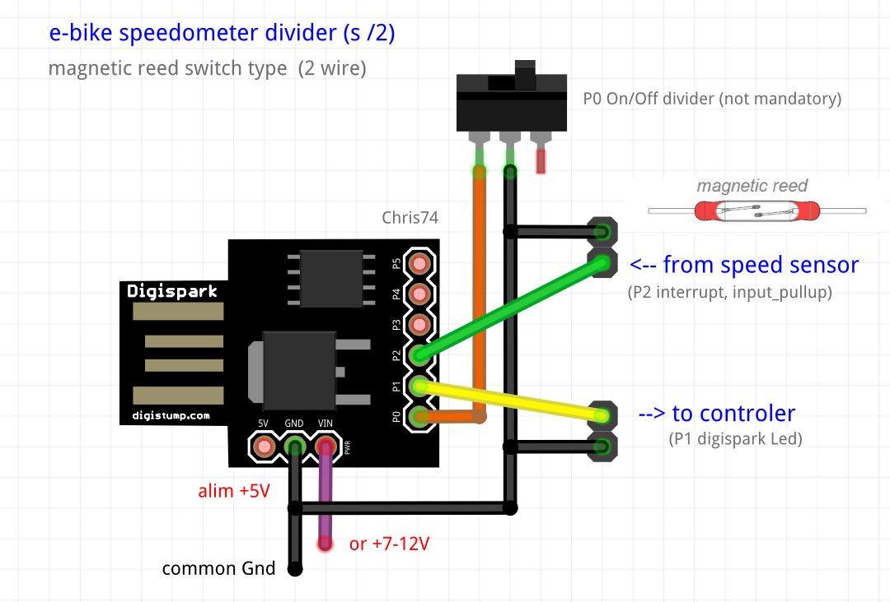
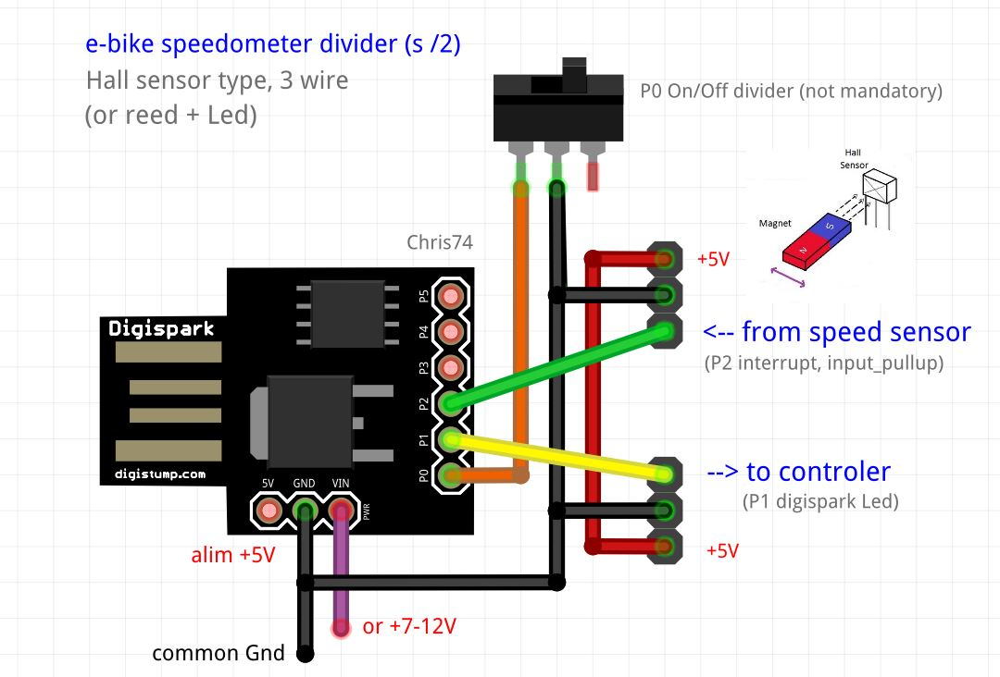
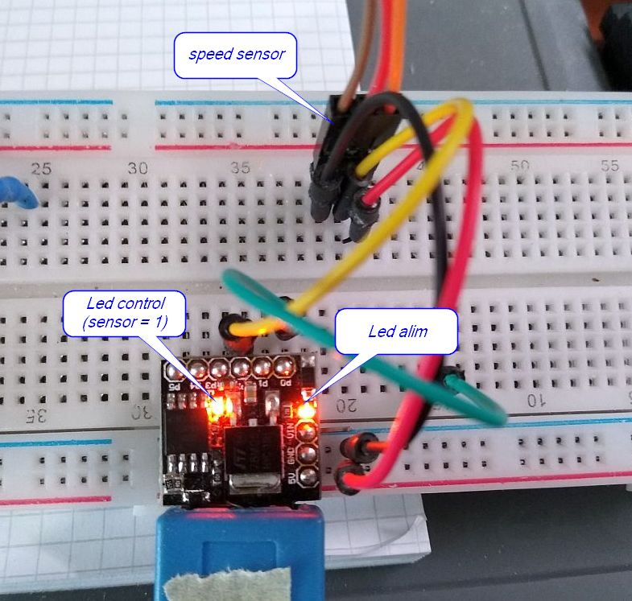

# e-bike speedometer divider

Hacking e-bike speedometer   
Expl: if 30Km/h real, ebike read 15Km/h  
Choose diagram reed switch (2 wire) or hall sensor (3 wire)

Digispark Attiny85, install and doc :  
https://tuxamito.com/wiki/index.php/Digispark  
You can find Digispark Attiny85 modules for less than 2$ on Aliexpress !

note: If you do not want to lose the bike warranty you can buy a speedometer cable according to your model.

### Diagram with magnetic reed switch, 2 wire 

  

### Diagram with hall sensor, 3 wire

  

### Internal Led Digispark (P1)

  

